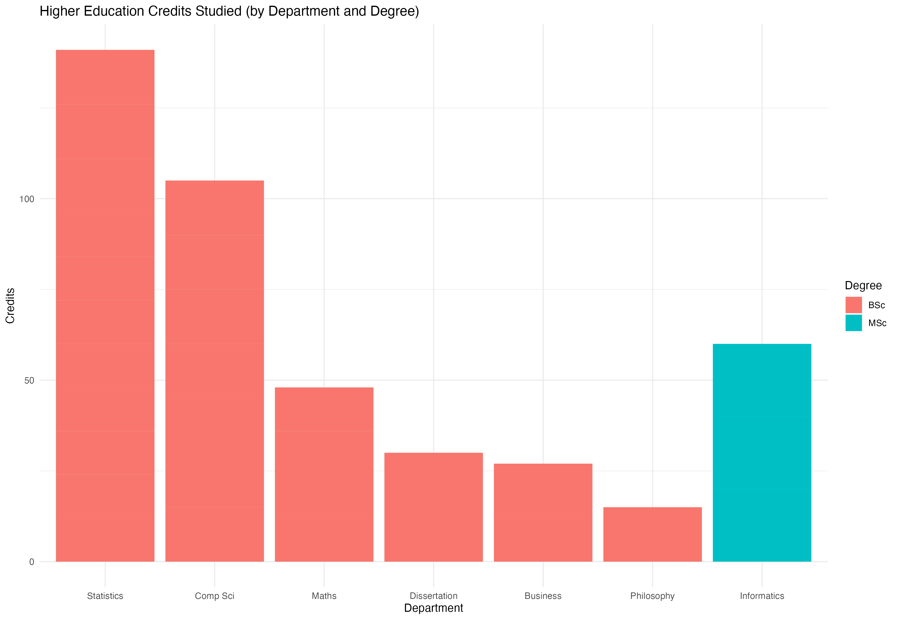
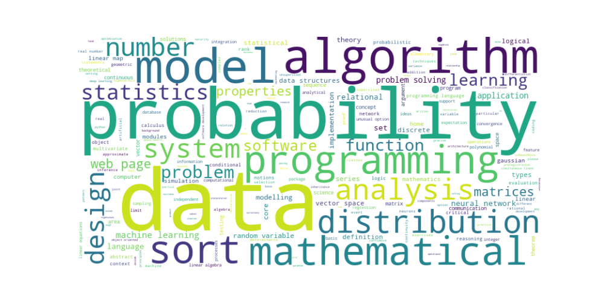

# Education and Employment

## Higher Education History

### Overview 

A high-level overview of my higher education history. 

My BSc in Data Science was dominated by modules that taught statistics and computer science fundamentals, complemented by key topics in maths during my first year.

### Topics Studied

The range of topics taught within an entire department at university level is massive. What does the graph above really mean?

To be more precise, the wordcloud below highlights topics studied.

TODO: write explaination of how I produced wordcloud.

